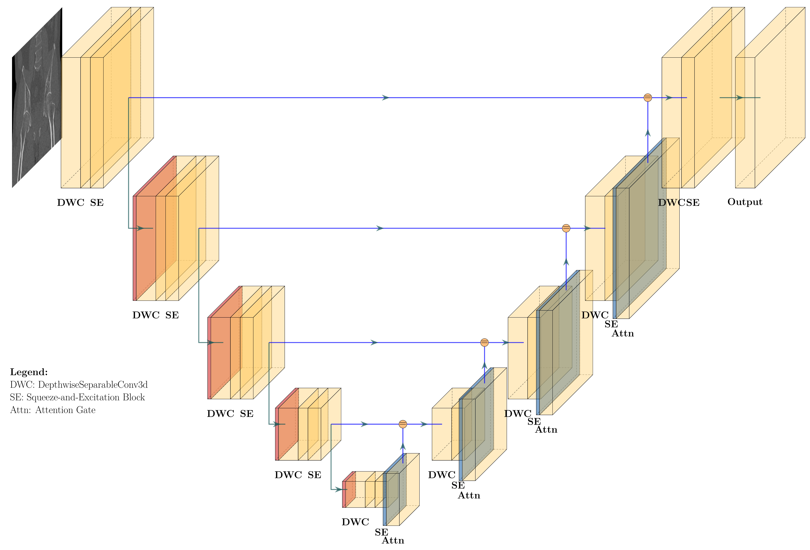
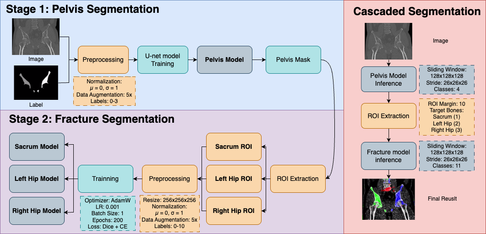

# CT_seg 说明文档 / CT_seg README

## 项目简介 / Project Overview

本项目用于骨盆CT分割，采用了基于3D U-Net的深度学习方法。下图展示了我们所用的网络结构和训练流程：

- **Unet网络结构图 / Unet Architecture**  
  

- **训练Pipeline / Training Pipeline**  
  

---

## 目录结构 / Directory Structure

```
ct_seg/
│
├── image/                # 存放网络结构和pipeline图片
│   ├── Unet网络.png
│   └── pipeline.png
│
├── 3stage/               # 三阶段分割相关的中间结果与模型
│   ├── models/           # 各阶段训练好的模型
│   ├── visualizations/   # 可视化结果图片
│   ├── checkpoints/      # 训练过程中的模型权重快照
│   ├── logs/             # 训练日志
│   ├── results/          # 推理或评估结果
│   └── roi_cache/        # 感兴趣区域缓存
│
├── training_code/        # 训练和推理相关的主要代码
│   ├── train_pelvis_pipeline.py   # 本地三阶段训练脚本
│   ├── colab_3stage_pipeline.ipynb/py # Colab三阶段训练notebook/脚本
│   ├── Unet_colab.py/ipynb        # U-Net模型定义与训练
│   ├── Deeplab.ipynb              # 其他模型实验
│   └── Unet.txt                   # U-Net结构文本描述
│
├── data/                 # 数据集及其缓存
│   ├── imagesTr/         # 训练用CT图像（.nii.gz格式）
│   ├── labelsTr/         # 训练用标签（.nii.gz格式）
│   ├── roi_cache/        # 预处理后的ROI大文件（npy格式）
│   └── ...               # 其他原始/中间数据
│
├── tools/                # 数据处理工具脚本
│   └── convert_mha_to_nifti.py    # mha转nifti格式脚本
│
└── README.md             # 项目说明文档
```

---

## 主要文件夹说明 / Main Folder Descriptions

- **image/**  
  存放网络结构图和训练流程图，便于理解整体方案。

- **3stage/**  
  三阶段分割流程的相关输出，包括模型、可视化、日志、推理结果等。

- **training_code/**  
  主要的训练、推理、模型定义代码。  
  - `train_pelvis_pipeline.py`：主训练脚本，包含数据加载、模型训练、验证等完整流程。  
  - `Unet_colab.py/ipynb`：U-Net 3D模型的定义与训练实现。  
  - `Deeplab.ipynb`：其他分割模型的实验。  
  - `Unet.txt`：U-Net结构的详细文本描述。

- **data/**  
  存放原始和预处理后的CT图像、标签、ROI缓存等。  
  - `imagesTr/`、`labelsTr/`：训练用的CT图像和标签，nifti格式。  
  - `roi_cache/`：分割前的感兴趣区域缓存，加速训练。

- **tools/**  
  数据格式转换等辅助脚本。

---

## 网络结构简介 / Network Architecture

本项目采用的3D U-Net结构，核心特点包括：
- 编码器-解码器结构，支持体数据输入。
- 深度可分离卷积（DepthwiseSeparableConv3d）提升效率。
- 通道注意力（SEBlock）增强特征表达。
- 注意力门控（AttentionGate）优化跳跃连接。
- 支持多类别分割（如骨盆、髋骨、骶骨等）。

---

## 训练流程简介 / Training Pipeline

1. **数据准备**：将CT图像和标签转换为nifti格式，按需裁剪ROI。
2. **模型训练**：采用滑动窗口方式进行patch训练，支持多类别分割。
3. **验证与可视化**：训练过程中自动保存最优模型，并可对分割结果进行三视图可视化。
4. **推理与评估**：支持对新数据的分割与评估，输出分割mask和可视化结果。

---

如需详细使用方法或代码说明，请参考`training_code/`下的脚本和notebook。

---

**English Summary**

This project is for pelvic CT segmentation using a 3D U-Net-based deep learning approach.  
- The `image/` folder contains the Unet architecture and training pipeline diagrams.
- The `3stage/` folder stores models, visualizations, logs, and results for the three-stage segmentation process.
- The `training_code/` folder contains main training and inference scripts, including the 3D U-Net model.
- The `data/` folder holds training images, labels, and ROI caches.
- The `tools/` folder provides data conversion scripts.

The 3D U-Net model features depthwise separable convolutions, channel attention (SEBlock), and attention gates for skip connections, supporting multi-class segmentation.

For more details, see the scripts and notebooks in `training_code/`.

---