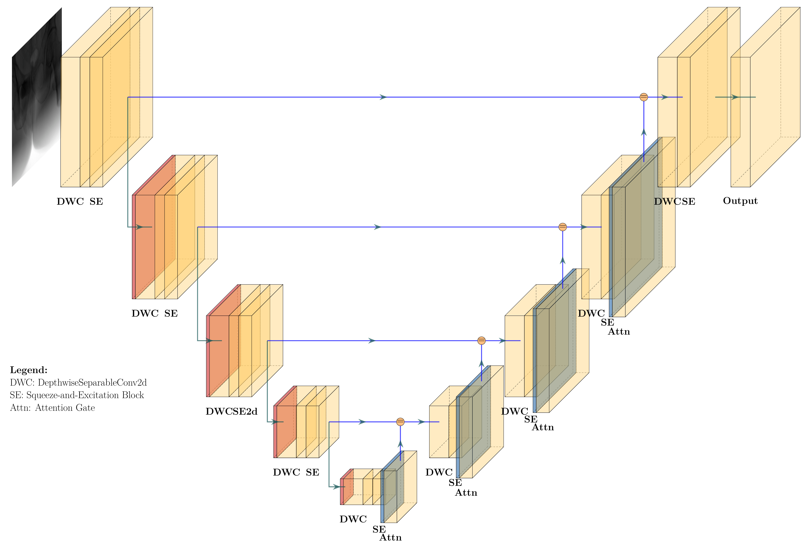
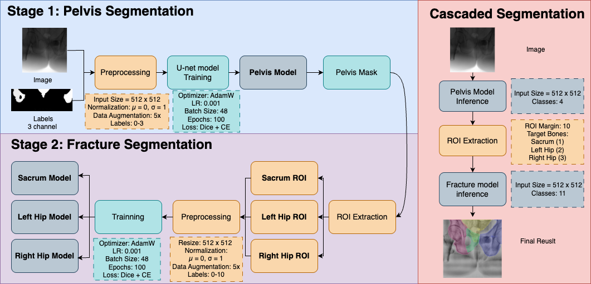

# XRay_seg 说明文档 / XRay_seg README

## 项目简介 / Project Overview

本项目用于骨盆X光分割，采用了基于2D U-Net的深度学习方法。下图展示了我们所用的网络结构和训练流程：

- **2D U-Net网络结构图 / 2D U-Net Architecture**  
  

- **训练Pipeline / Training Pipeline**  
  

---

## 主要参数 / Main Parameters

- **输入尺寸 / Input Size**：512 × 512
- **归一化 / Normalization**：均值0，方差1 / mean=0, std=1
- **标签 / Labels**：三通道（1=骶骨，2=左髋骨，3=右髋骨）
- **网络结构 / Model**：2D U-Net（含DepthwiseSeparableConv2d、SEBlock、Attention Gate）
- **优化器 / Optimizer**：AdamW
- **学习率 / Learning Rate**：0.001
- **Batch Size**：48
- **Epochs**：100
- **损失函数 / Loss**：多类别Dice + CrossEntropy

---

## 目录结构 / Directory Structure

```
xray_seg/
│
├── Image/                # 网络结构和pipeline图片
│   ├── my_unet2d_Ushape.png
│   └── xrayPipeline.png
│
├── data/                 # 数据集及其缓存
│   ├── train/input/images/x-ray/    # 训练用X光图像（.tif）
│   ├── train/output/images/x-ray/   # 训练用标签（.tif）
│   └── result/                      # 训练和推理结果
│
├── training_code/        # 训练和推理相关的主要代码
│   └── train_3stage_pipline.py     # 主训练脚本
│
└── README.md             # 项目说明文档
```

---

## 主要文件说明 / Main File Descriptions

- **Image/**  
  存放网络结构图和训练流程图，便于理解整体方案。

- **data/**  
  存放原始和预处理后的X光图像、标签、训练结果等。

- **training_code/train_3stage_pipline.py**  
  主要的训练、推理、模型定义代码，包含三阶段分割流程（骨盆分割、骨折分割、级联推理）。

---

## 网络结构简介 / Network Architecture

本项目采用的2D U-Net结构，核心特点包括：
- 编码器-解码器U型结构，支持2D X光图像输入。
- 深度可分离卷积（DepthwiseSeparableConv2d）提升效率。
- 通道注意力（SEBlock）增强特征表达。
- 注意力门控（Attention Gate）优化跳跃连接。
- 支持多类别分割（如骨盆、髋骨、骶骨等）。

---

## 训练流程简介 / Training Pipeline

1. **数据准备**：将X光图像和标签缩放为512x512，归一化处理，分为训练集和验证集。
2. **模型训练**：采用2D U-Net进行训练，支持多类别分割，损失函数为多类别Dice+交叉熵。
3. **验证与可视化**：训练过程中自动保存最优模型，并可对分割结果进行可视化。
4. **推理与评估**：支持对新数据的分割与评估，输出分割mask和可视化结果。

---

如需详细使用方法或代码说明，请参考`training_code/`下的脚本。

---

**English Summary**

This project is for pelvic X-ray segmentation using a 2D U-Net-based deep learning approach.  
- The `Image/` folder contains the 2D U-Net architecture and training pipeline diagrams.
- The `data/` folder holds training images, labels, and results.
- The `training_code/` folder contains main training and inference scripts, including the 2D U-Net model and three-stage pipeline.

The 2D U-Net model features depthwise separable convolutions, channel attention (SEBlock), and attention gates for skip connections, supporting multi-class segmentation.

For more details, see the scripts in `training_code/`.

---
